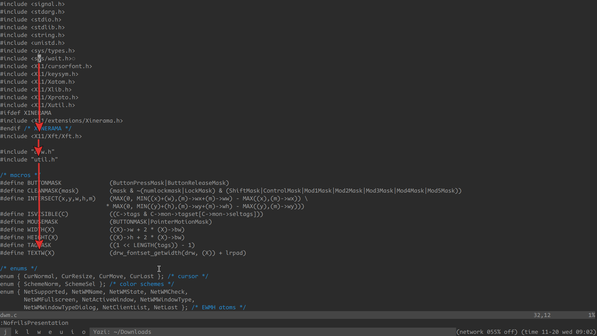
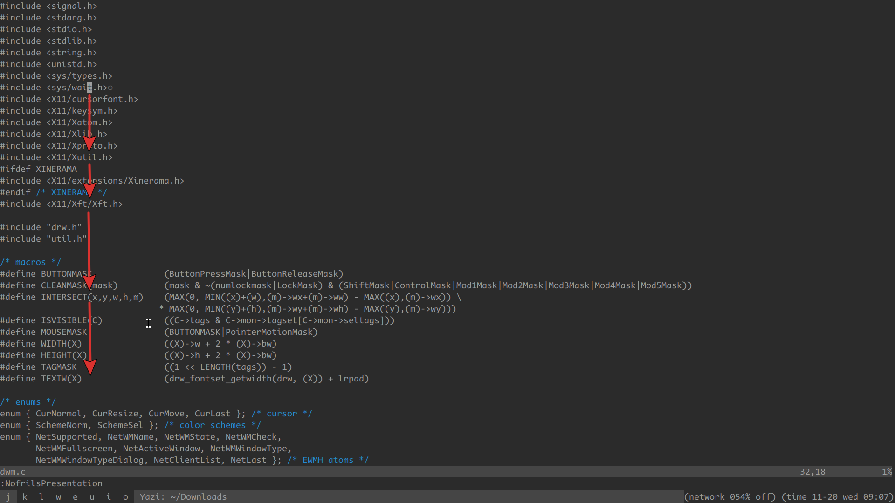

this plugin provides 2 paragraph motions:

- para1
- para2

# demo



para1 is like the `{` and `}` motions but before the empty line



para2 is like the `E` and `B` motions but vertical

# install

1. install
2. setup

```
require("paramo").setup({
	para1_backward = "(",
	para1_forward  = ")",
	para2_backward = "<home>",
	para2_forward  = "<end>",
})
```

## lazy.nvim

```
{
	"aidancz/paramo.nvim",
	config = function()
		require("paramo").setup({
			para1_backward = "(",
			para1_forward  = ")",
			para2_backward = "<home>",
			para2_forward  = "<end>",
		})
	end,
}
```
