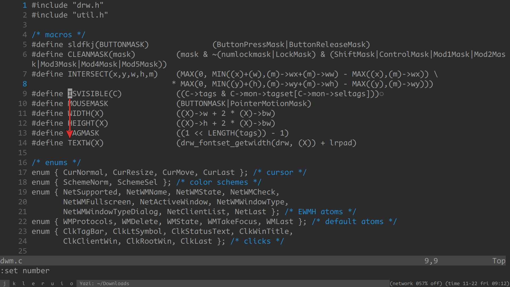
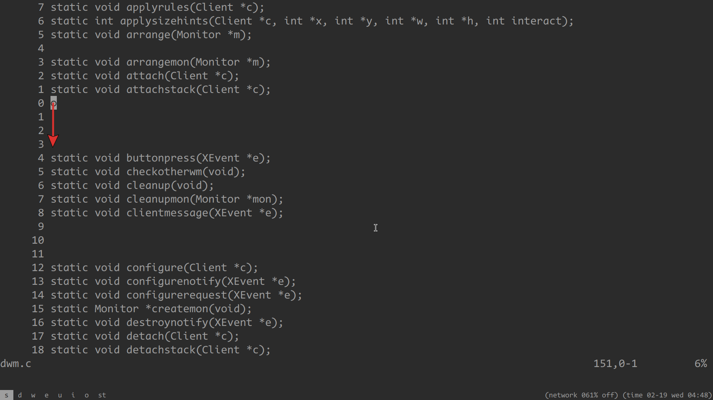

paramo.nvim provides 4 kinds of paragraph motions:

- para0
- para1
- para2
- para3

# demo

a paragraph is essentially a sequence of lines

i refer to the first line as the "head" and the last line as the "tail"

this plugin makes it easy to navigate to both the head and tail

## para0


para0 treats a logical line as a paragraph, where a logical line may span multiple screen lines (when `:set wrap`)

## para1



para1 treats a sequence of non-empty lines as a paragraph

## para2



para2 treats a sequence of empty lines as a paragraph

## para3


para3 treats a sequence of lines containing characters in the cursor's column as a paragraph

para3 is like the `E` and `B` motions but vertical

to understand the concept of para3, you may want to `:set cursorcolumn`

# setup

## setup example 1:

```
require("paramo").setup({
	{
		type = "para1",
		backward = {
			head = "<a-b>",
			tail = "<a-g>",
			head_or_tail = "<a-p>",
		},
		forward = {
			head = "<a-w>",
			tail = "<a-e>",
			head_or_tail = "<a-n>",
		},
	},
	{
		type = "para3",
		backward = {
			head_or_tail = "<a-k>",
		},
		forward = {
			head_or_tail = "<a-j>",
		},
	},
})
```

## setup example 2:

you can simulate the builtin `{` and `}` motions with:

```
require("paramo").setup({
	{
		type = "para2",
		backward = {
			tail = "{",
		},
		forward = {
			head = "}",
		},
	},
})
```
