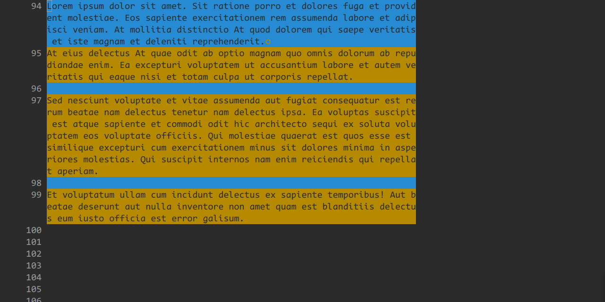
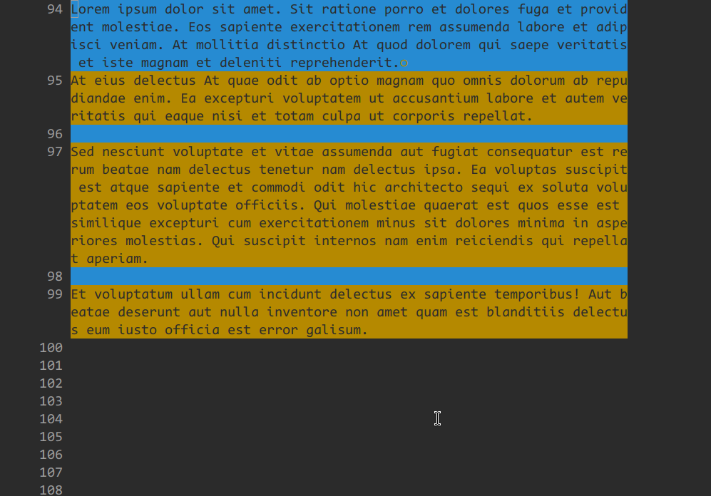
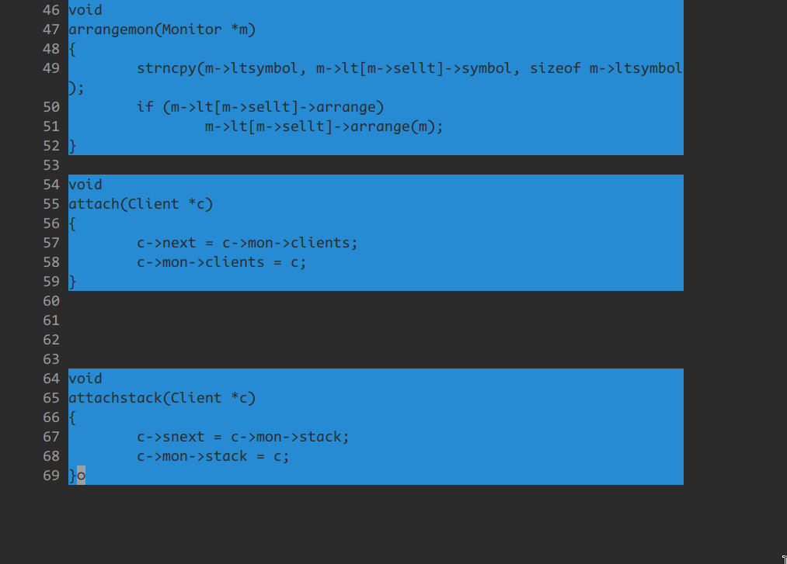
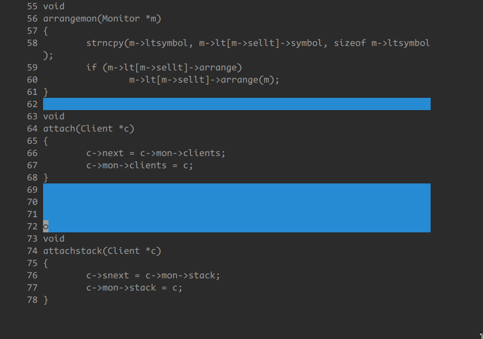
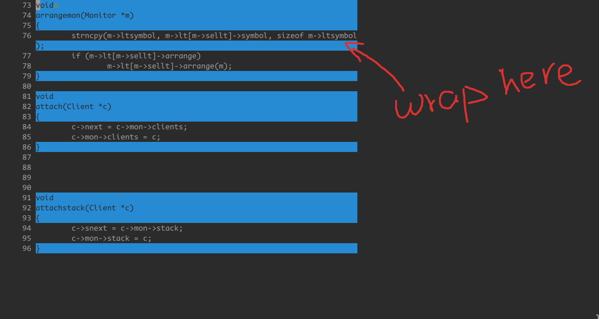
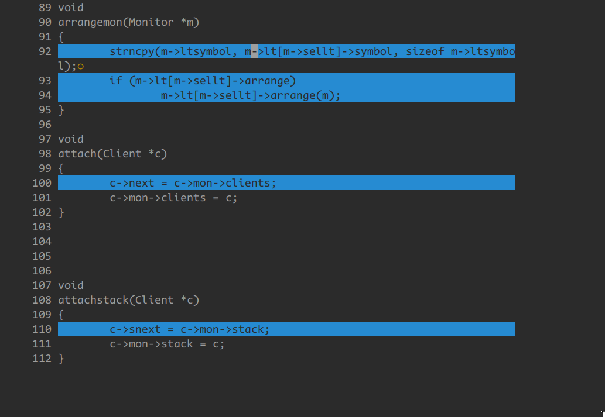
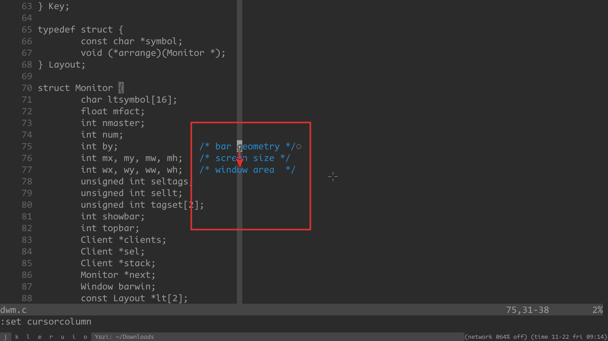
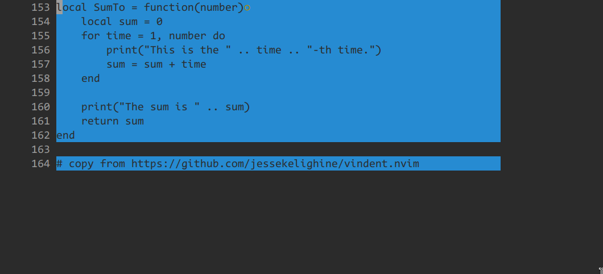
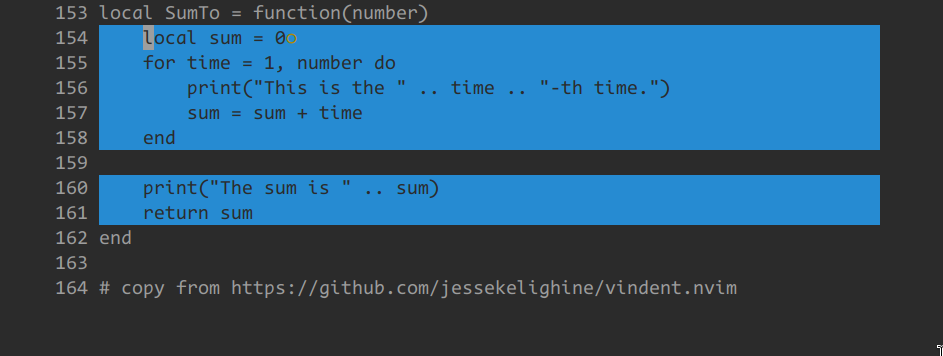

paramo.nvim provides 5 kinds of paragraph motions:

- para0
- para1
- para2
- para3
- para4

# demo

a paragraph is a sequence of lines

i refer to the first line as the "head" and the last line as the "tail"

this plugin makes it easy to navigate to both the head and tail

WORKS VERY WELL VIRTUALEDIT WRAP

in the image below, i use continuous blue or yellow to mark the paragraphs that the specific "paramo" considers

## para0






para0 treats a logical line as a paragraph, where a logical line may span multiple screen lines (when `:set wrap`)

## para1



para1a treats a sequence of non-empty lines as a paragraph



para1b treats a sequence of empty lines as a paragraph

## para2





para2 treats a sequence of lines containing characters in the cursor's column as a paragraph

so the definition of para2 changes depending on the position of the cursor (note the position of the cursor in the image)

to understand the concept of para2, you may want to `:set cursorcolumn` and `:set virtualedit=all`

the image shows para2a

para2b is the opposite of para2a

## para3



para3 treats lines with the same indent as a paragraph

para3a: indent = any
para3b: indent = current
para3c: indent != current
para3d: indent > current
para3e: indent < current

## para4





para4 treats lines with the same or more indent as a paragraph

para4a: indent = any
para4b: indent = current
para4c: indent != current
para4d: indent > current
para4e: indent < current

# summary

all para types are listed below:

```
- para0

- para1a
- para1b

- para2a
- para2b

- para3a
- para3b
- para3c
- para3d
- para3e

- para4a
- para4b
- para4c
- para4d
- para4e
```

# setup

## setup example 1:

```
require("paramo").setup({
	{
		type = "para1",
		backward = {
			head = "<a-b>",
			tail = "<a-g>",
			head_or_tail = "<a-p>",
		},
		forward = {
			head = "<a-w>",
			tail = "<a-e>",
			head_or_tail = "<a-n>",
		},
	},
	{
		type = "para3",
		backward = {
			head_or_tail = "<a-k>",
		},
		forward = {
			head_or_tail = "<a-j>",
		},
	},
})
```

## setup example 2:

you can simulate the builtin `{` and `}` motions with:

```
require("paramo").setup({
	{
		type = "para2",
		backward = {
			tail = "{",
		},
		forward = {
			head = "}",
		},
	},
})
```

## setup example 3:

this is my current setup:

```
require("paramo").setup({
	{
		type = "para1",
		backward = {
			head = "<a-b>",
			tail = "<a-g>",
		},
		forward = {
			head = "<a-w>",
			tail = "<a-e>",
		},
	},
	{
		type = "para2",
		backward = {
			head = "(",
			tail = "{",
		},
		forward = {
			head = "}",
			tail = ")",
		},
	},
	{
		type = "para3",
		backward = {
			head_or_tail = "<pageup>",
		},
		forward = {
			head_or_tail = "<pagedown>",
		},
	},
})
```

# related plugins
