paramo.nvim enhances vertical movement in nvim

paramo.nvim handles `wrapped lines` gracefully and plays nicely with `virtualedit`

# install

[paramo.nvim](https://github.com/aidancz/paramo.nvim) depends on [virtcol.nvim](https://github.com/aidancz/virtcol.nvim), make sure both are installed

for example, with [mini.deps](https://github.com/echasnovski/mini.nvim/blob/main/readmes/mini-deps.md):

```lua
require("mini.deps").add({
	source = "aidancz/paramo.nvim",
	depends = {
		{
			source = "aidancz/virtcol.nvim",
		},
	},
})
```

# quick start

add these codes to your config and see if you can figure out what these keymaps mean 😊

> [!NOTE]
>
> throughout this readme, it's recommended to set `vim.o.virtualedit = "all"` to clearly observe how the motions behave

<details>

<summary>click me</summary>

```lua
local map = function(key, direction, is, hook)
	vim.keymap.set(
		{"n", "x", "o"},
		key,
		function()
			return
			require("paramo").expr({
				direction = direction,
				is = is,
				hook = hook,
			})
		end,
		{expr = true}
	)
end

map("{", "prev", require("para_nonempty_reverse").is_head_or_tail)
map("}", "next", require("para_nonempty_reverse").is_head_or_tail)

map("<a-u>", "prev", require("para_nonempty").is_head)
map("<a-d>", "next", require("para_nonempty").is_tail)

map("<a-w>", "next", require("para_cursor_column").is_head)
map("<a-e>", "next", require("para_cursor_column").is_tail)
map("<a-b>", "prev", require("para_cursor_column").is_head)

local caret = function() vim.cmd("normal! ^") end
map("<pageup>",   "prev", require("para_cursor_indent").is_head_or_tail, caret)
map("<pagedown>", "next", require("para_cursor_indent").is_head_or_tail, caret)
map(
	"<",
	"next",
	function(pos)
		return
		require("para_cursor_indent").is_head(
			pos,
			function(a, b)
				return a < b
			end
		)
	end,
	caret
)
map(
	">",
	"next",
	function(pos)
		return
		require("para_cursor_indent").is_head(
			pos,
			function(a, b)
				return a > b
			end
		)
	end,
	caret
)
map(
	"(",
	"prev",
	function(pos)
		return
		require("para_cursor_indent").is_head(
			pos,
			function(a, b)
				return a < b
			end
		)
	end,
	caret
)
map(
	")",
	"prev",
	function(pos)
		return
		require("para_cursor_indent").is_head(
			pos,
			function(a, b)
				return a > b
			end
		)
	end,
	caret
)
```

</details>

put this to your config and see what those keymaps does

## virtcol.nvim

the vertical movement ability of `paramo.nvim` comes from `virtcol.nvim`,

for example, you can simulate the builtin `gj` with:

```lua
vim.keymap.set(
	"n",
	"<down>",
	function()
		local m = require("virtcol")
		m.set_cursor(m.next_pos(m.get_cursor()))
	end
)
```

## glossary

`pos` refers to a table with `lnum` and `virtcol` fields, for example:

```lua
{
	lnum = 37,
	virtcol = 42,
}
```

`is` refers to a function that takes a `pos` and returns a boolean, for example:

```lua
function(pos)
	if pos.lnum % 2 == 0 then
		return false
	else
		return true
	end
end
```


o


a paragraph is a sequence of lines

i refer to the first line as the "head" and the last line as the "tail"

this plugin makes it easy to navigate to "head" and "tail"

in the image below, i use continuous blue or yellow to mark the paragraphs that the specific paramo considers

## para_wrap_line

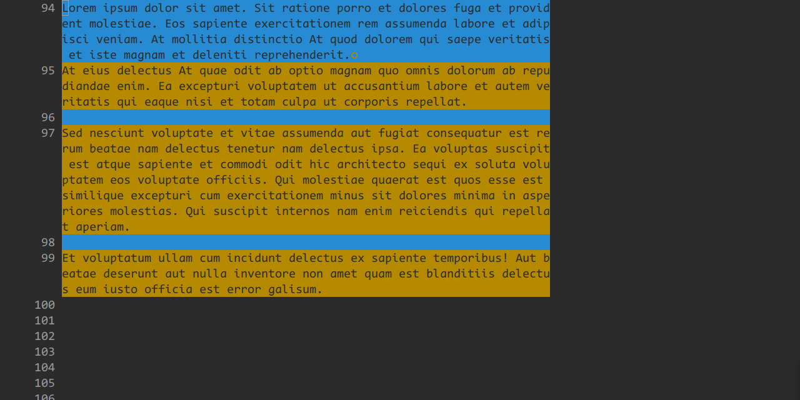

para_wrap_line treats a logical line as a paragraph, where a logical line may span multiple screen lines (when `:set wrap`)

## para1

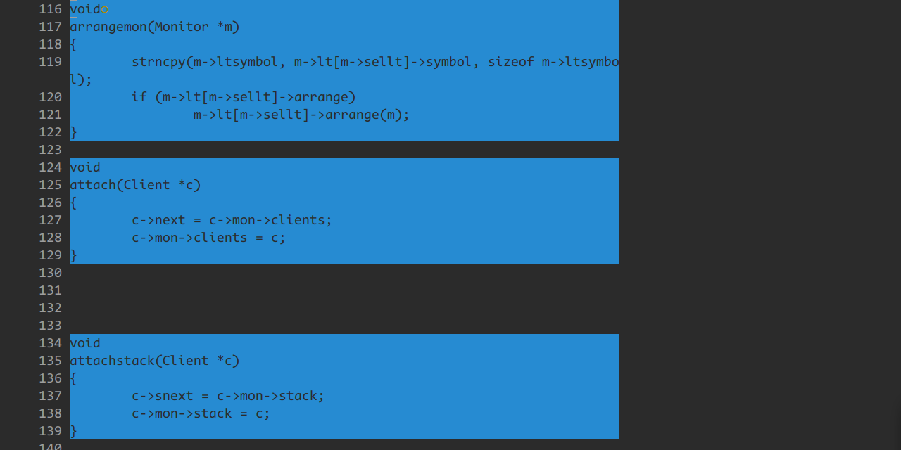

para1 treats a sequence of **non-empty** lines as a paragraph with this config:

```
{
	empty = false
}
```

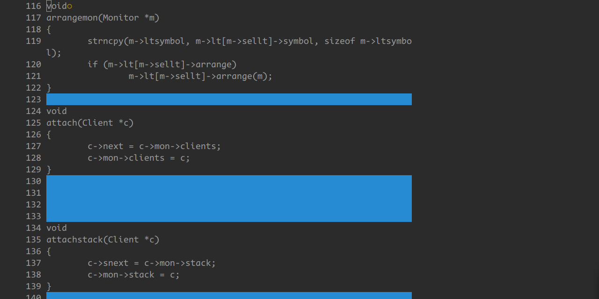

para1 treats a sequence of **empty** lines as a paragraph with this config:

```
{
	empty = true
}
```

## para2

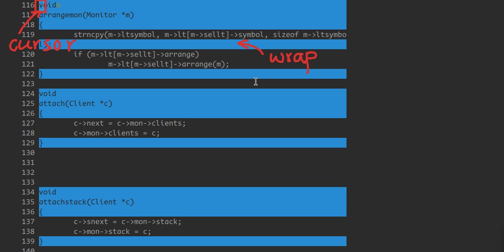

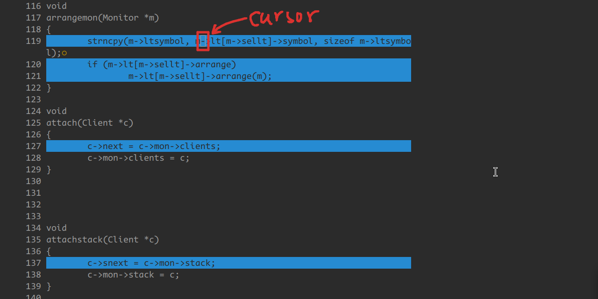

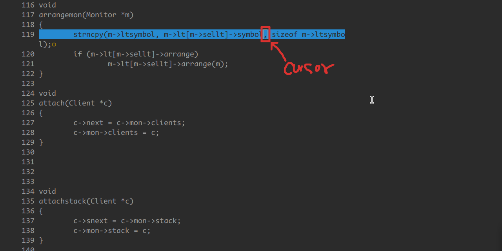

para2 treats a sequence of lines **containing** characters in the **cursor's column** as a paragraph with this config:

```
{
	empty = false
}
```

so the definition of para2 changes depending on the position of the cursor (note the position of the cursor in the image)

to understand the concept of para2, you may want to `:set cursorcolumn` and `:set virtualedit=all`

para2 treats a sequence of lines **not containing** characters in the **cursor's column** as a paragraph with this config:

```
{
	empty = true
}
```

## para3

para3 treats lines with the same indent as the current line as one paragraph

you can adjust the behavior by changing the config

for example:

---

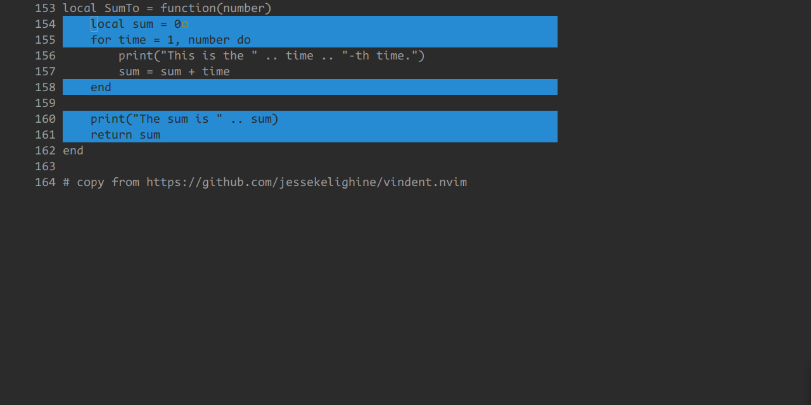

config:

```
{
	include_more_indent = false,
	include_empty_lines = false,
}
```

---

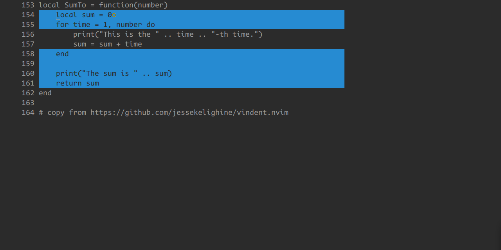

config:

```
{
	include_more_indent = false,
	include_empty_lines = true,
}
```

---

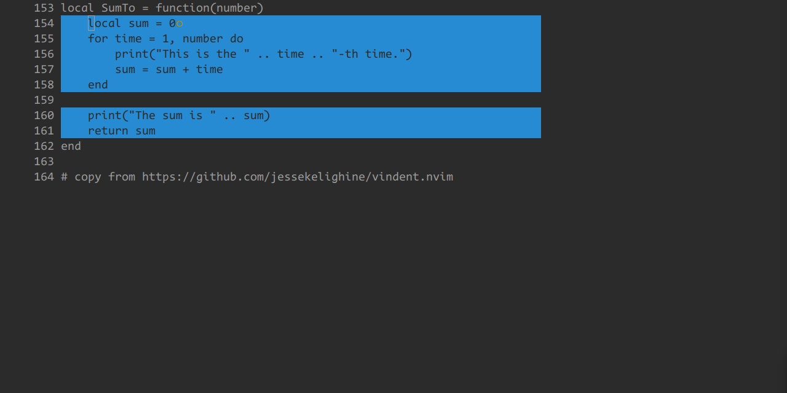

config:

```
{
	include_more_indent = true,
	include_empty_lines = false,
}
```

---

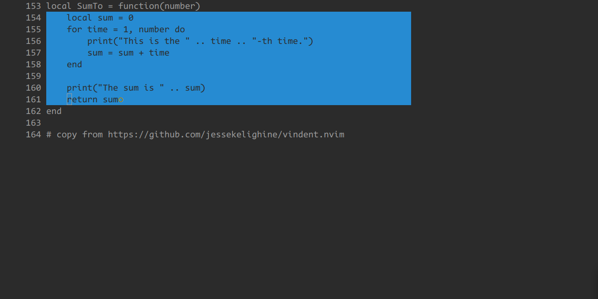

config:

```
{
	include_more_indent = true,
	include_empty_lines = true,
}
```

## para3a

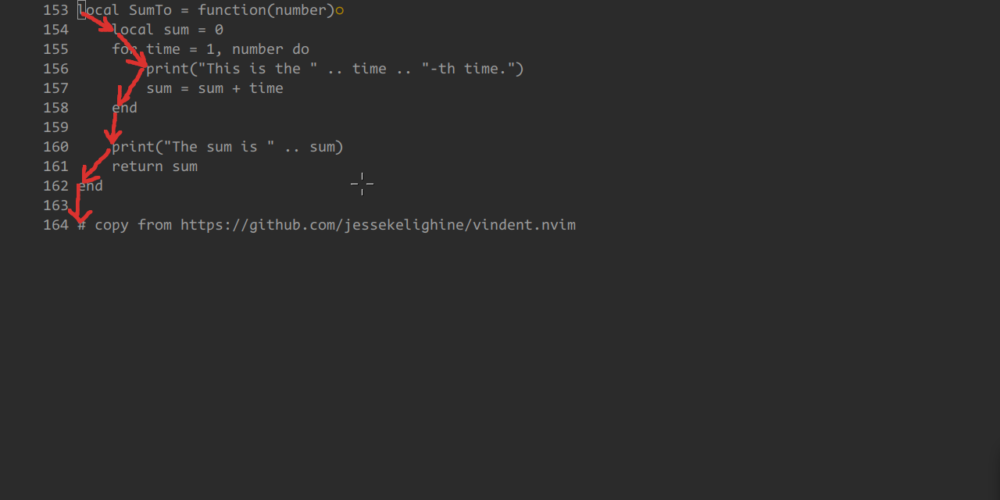

para3a allows navigation across different indent levels and can be configured by:

```
{
	indent = "eq",
}
```

possible values:

```
	indent = "eq", -- equal indent to current
	indent = "gt", -- greater indent than current
	indent = "lt", -- less indent than current
	indent = "neq", -- not eq
	indent = "ngt", -- not gt
	indent = "nlt", -- not lt
	indent = "any", -- any indent
```

## para4

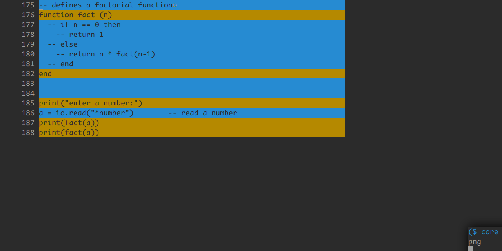

para4 treats lines with the same first non-blank character as one paragraph

i use para4 to create comment textobject

# setup

## setup example 1:

```
require("paramo").setup({
	{
		type = "para1",
		type_config = {
			empty = false,
		},
		backward = {
			head = "<a-b>",
			tail = "<a-g>",
			head_or_tail = "<a-p>",
		},
		forward = {
			head = "<a-w>",
			tail = "<a-e>",
			head_or_tail = "<a-n>",
		},
	},
})
```

## setup example 2:

you can simulate the builtin `{` and `}` motions with:

```
require("paramo").setup({
	{
		type = "para1",
		type_config = {
			empty = true,
		},
		backward = {
			tail = "{",
		},
		forward = {
			head = "}",
		},
	},
})
```

## setup example 3:

```
require("paramo").setup({
	{
		type = "para0",
		backward = {
			head_or_tail = "<a-k>",
		},
		forward = {
			head_or_tail = "<a-j>",
		},
	},
	{
		type = "para3",
		type_config = {
			include_more_indent = false,
			include_empty_lines = false,
		},
		forward = {
			head = "<down>"
		},
	},
})
```

# textobjects

paramo.nvim does not have any textobjects built in

however, you can use the api together with other textobjects plugins to get the desired textobjects

for example, [mini.ai](https://github.com/echasnovski/mini.nvim/blob/main/readmes/mini-ai.md):

```
i = function(ai_type)
	local head_and_tail
	if ai_type == "i" then
		head_and_tail =
			require("paramo").get_head_and_tail(
				"para3",
				{
					include_more_indent = false,
					include_empty_lines = false,
				}
			)
	else
		head_and_tail =
			require("paramo").get_head_and_tail(
				"para3",
				{
					include_more_indent = false,
					include_empty_lines = true,
				}
			)
	end
	return {
		from = {
			line = head_and_tail.head,
			col = 1,
		},
		to = {
			line = head_and_tail.tail,
			col = 1,
		},
		vis_mode = "V",
	}
end,
```

# related plugins

https://github.com/jessekelighine/vindent.vim
